# Magnetic Resonance Imaging (361.2.6501) — Final Project

**MRI Restoration from Subsampled k-space**

- Authors: Michal Yechezkel (ID: 322556267), Almog Talker (ID: 322546680)
- GitHub repository: \<PUBLIC GITHUB LINK — paste after pushing; see README, "Submission checklist"\>

> **To complete before exporting to PDF.** No retraining is needed — every number below
> that is already filled in is final, and the ADMM-Net runs are reused as they are.
>
> 1. On the machine that has the dataset, run README runbook steps 2–6. Steps 2, 3, 5 and 6
>    are evaluation-only (minutes); only the U-Net reference in step 4 trains, and it is
>    optional. This produces the calibrated baseline and the five figures still marked
>    *pending* below: `eda_panel`, `per_stage_reconstruction`, `qualitative_examples`,
>    `model_vs_unet`, `crossmask`.
> 2. Re-run `python -m src.make_report_tables` and replace every value marked
>    **`[after step 3]`**.
> 3. Paste the public GitHub link above.

---

## Abstract

We address **MRI reconstruction from subsampled k-space** (Task 3.2). An accelerated
acquisition is simulated by undersampling k-space with a 1D variable-density Gaussian mask
that keeps 20% / 30% / 50% of the phase-encode lines, and the complex-valued image is
reconstructed from the aliased, zero-filled input. We compare a **classical
compressed-sensing baseline** (multi-level wavelet ℓ₁ + total variation, with POCS data
consistency, calibrated on the validation split) against **our model**, an **unrolled
ADMM-Net** that learns the proximal operator and the data-consistency weighting of the same
optimization problem. PSNR and SSIM are evaluated on the real and imaginary components
separately over a 479-subject age-matched test set, with three seeds per configuration.
Our model wins at every sampling ratio and on **every single test slice** (1434/1434
slice–seed pairs at each ratio), improving on the zero-filled input by **+17.4 dB at 20%,
+19.6 dB at 30% and +22.1 dB at 50%** and raising SSIM on the real channel from 0.39 to
0.92 at 20% and from 0.52 to 0.99 at 50%. The gap over the classical baseline grows with
the sampling ratio, because the extra measured lines are worth more to a learned prior than
to a fixed analytic one.

## Introduction, Objective, and Data Description

**Challenge.** The main bottleneck of MRI is scan time: a full k-space acquisition takes
minutes, which reduces patient comfort, invites motion artifacts, and is especially limiting
for fetal, cardiac and functional MRI. Sampling only a fraction of k-space accelerates the
scan proportionally but violates the **Nyquist criterion**, so the naive (zero-filled)
reconstruction shows **aliasing artifacts** and loss of resolution. The objective is to
recover an anatomically faithful image from the undersampled acquisition, decoupling scan
time from image quality.

**k-space and the forward model.** The scanner samples the spatial-frequency domain
(k-space); the image is its 2D inverse Fourier transform. Acceleration is modelled as a
binary sampling mask `M` applied in k-space,

```
y = M · F(x)
```

where `x` is the complex image and `F` the Fourier transform. Reconstruction is the
ill-posed inverse of this operator. Because low frequencies near the centre of k-space carry
most of the image energy and all of the tissue contrast, our mask draws phase-encode lines
from a **normal distribution centred on the centre of k-space** (σ = 0.25·N), sampling low
frequencies densely and high frequencies sparsely. Sampling whole rows rather than
individual points reflects Cartesian acquisition, where a phase-encode line is the unit that
is actually skipped.

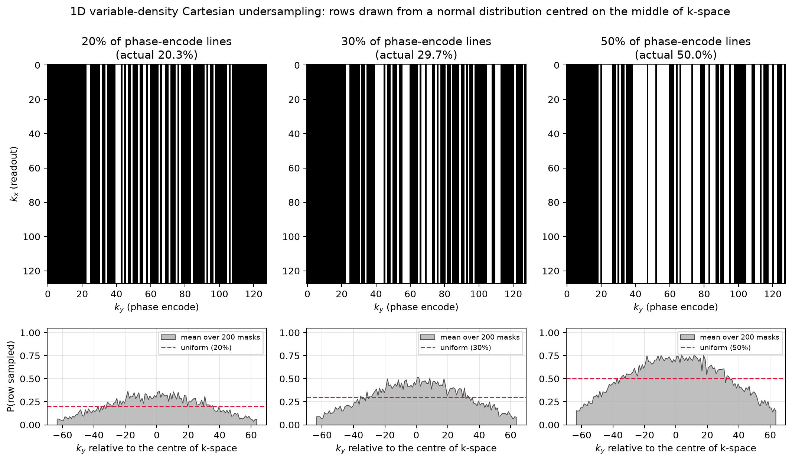

*The three sampling ratios. Top: one mask realization, centred for display. Bottom: the
probability that each row is acquired, averaged over 200 realizations, against the uniform
rate. At 30% the centre of k-space is acquired roughly 45% of the time and the outermost
rows about 10% of the time.* The requested ratios are met to within one row: 20% → 20.31%,
30% → 29.69%, 50% → 50.00% of 128 rows.

**Dataset.** Complex-valued 3D brain scans stored as `.npy`, with per-scan age and sex
metadata in CSV files. To keep the experiment tractable we use the **single central axial
slice of each subject** — a reduction the brief explicitly permits — so the number of
samples per split equals the number of subjects. Every slice is centre-cropped to 128×128
and normalized by the global maximum magnitude of its own volume, so each channel lies in
[−1, 1]. The identical rule is applied to every method, split and sampling ratio. Slices are
extracted once and cached, so all runs consume byte-identical data.

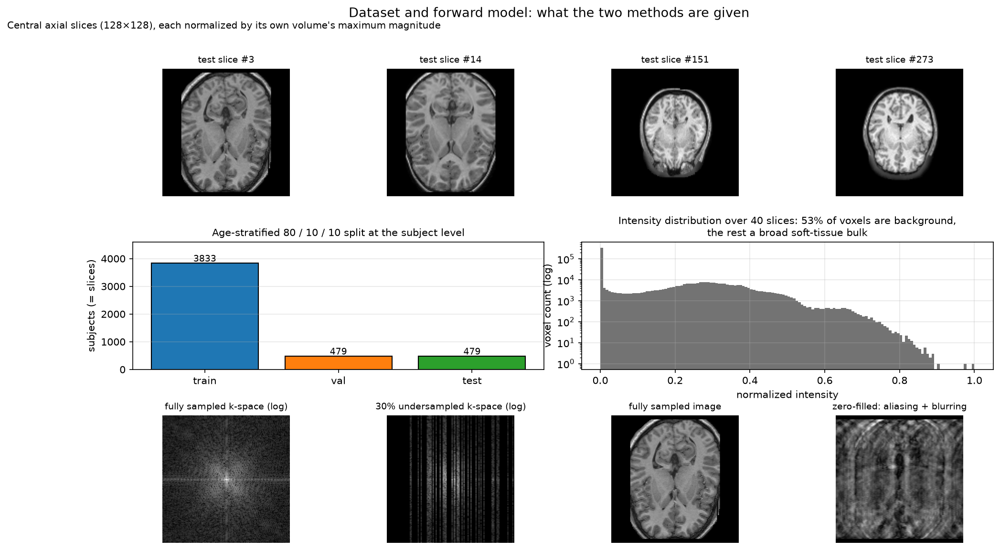

*Example central slices, the age distribution of the three splits, the intensity
distribution (a large low-signal background and a soft-tissue bulk), and a fully sampled vs
undersampled k-space pair with the resulting aliasing.*

**Custom split (professor's update).** The provided `test` CSV lists subjects that are not
present in the selected NumPy directory, so it cannot be used as given. We therefore
concatenated the three provided CSVs, cross-referenced them against the `.npy` files
actually on disk, and built our own **age-stratified three-way split**: subjects are placed
in quantile age bins and each bin is divided by the same 80/10/10 fractions, so the three
splits share the same age distribution.

| Split | # subjects | Age mean | Age std | Age range |
|-------|-----------:|---------:|--------:|-----------|
| Train | 3833       | 26.3     | 15.9    | 5–84      |
| Val   | 479        | 26.3     | 16.7    | 5–85      |
| Test  | 479        | 26.0     | 15.5    | 5–82      |

The means agree to within 0.3 years and the ranges are effectively identical, so no split is
biased towards a particular age group. The split is **fixed** (`data.split_seed`, independent
of `train.seed`), so every run and every seed uses the same partition; the three seeds vary
only the k-space mask realization and the network initialization. This is what allows the
per-sample scatter plots to pair the baseline and the model on identical test slices. Of the
479 test subjects, **478 volumes load and yield a usable central slice**, and that is the
number of measurements behind every test statistic below.

**Evaluation metrics.** For every test slice and sampling ratio we compute **PSNR** and
**SSIM** against the fully sampled image, on the **real and imaginary components
separately**, and report the mean and standard deviation **across the test set** (pooling the
three seeds, i.e. 3 × 478 = 1434 measurements per cell), line plots against the sampling
ratio, and sample-wise baseline-vs-model scatter plots with the Pearson correlation
coefficient.

*On reading the absolute dB values.* PSNR is computed with `peak = 2.0`, the width of the
[−1, 1] interval the channels are guaranteed to occupy. The measured RMS magnitude of a
central slice is about 0.2, so this peak is roughly ten times the typical signal and every
PSNR here is correspondingly higher than one computed from a per-image peak. The convention
is applied identically to every method, split and ratio, so all comparisons are unaffected;
for comparability with published work, subtracting a constant 20·log₁₀(2) = 6.02 dB restates
any value with `peak = 1.0`. Both conventions appear in `report/tables.md` (table 2). The
same effect explains why PSNR on the imaginary channel sits well above PSNR on the real
channel: the imaginary component carries a smaller amplitude, so a fixed peak flatters it.
It is not evidence that phase is reconstructed better than magnitude.

## Baseline Model

**Classical compressed sensing: multi-level wavelet ℓ₁ + total variation with POCS**
— `src/baselines/classical_cs.py`, registered as `classical_cs_tv`. A training-free
reconstruction grounded in the physics of the acquisition and in the anatomy of the subject.
Each iteration alternates three steps:

1. **Sparsity prior.** Soft-threshold the detail coefficients of a **three-level** Haar
   wavelet decomposition. Soft-thresholding is the proximal operator of the ℓ₁ norm, and
   brain images are approximately sparse in a wavelet basis.
2. **Total-variation prior.** A Chambolle proximal step on the isotropic TV penalty. This is
   the standard prior for compressed-sensing MRI (Lustig et al., 2007) and it is
   anatomically motivated: brain tissue is piecewise smooth with sharp boundaries between
   grey matter, white matter and CSF, so the image gradient is genuinely sparse, whereas
   undersampling aliasing is spread across the whole field of view.
3. **Data consistency (POCS).** Restore the measured k-space lines exactly and keep the
   current estimate everywhere else, enforcing agreement with what the scanner actually
   acquired.

Both priors are applied independently to the real and imaginary channels. There are no
learned parameters — only the number of iterations and the two regularization weights.

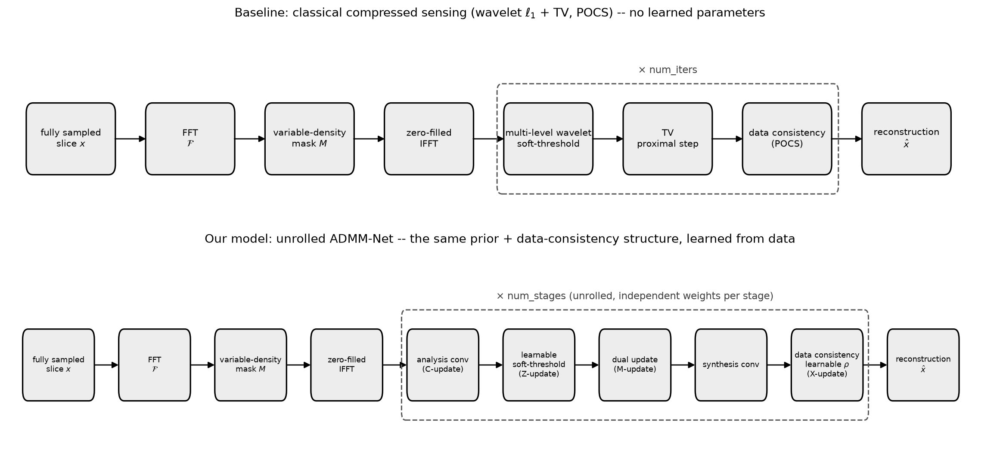

**Calibration.** Reporting an untuned baseline would understate it, so the wavelet threshold
`lam` and the TV weight `tv_weight` are selected by a 3 × 3 grid
(`configs/experiments/baseline_tuning.yaml`) **on the validation split only**; the test set
plays no part in the choice. Selected operating point: **`lam` = [after step 3],
`tv_weight` = [after step 3]** (table 4 of `report/tables.md`).

**Why the prior had to be strengthened (a result in itself).** Our first baseline used a
*single-level* Haar transform, which is the form usually written down in textbooks. It does
not reconstruct: a one-level decomposition only exposes the finest-scale detail
coefficients, so the shrinkage amounts to a mild local smoothing, and the subsequent POCS
projection undoes it — the iteration converges essentially back onto its own input. On a
Shepp-Logan phantom at 30% sampling it gains **+0.13 dB** over zero-filling, and no value of
`lam` across four orders of magnitude does better; on the real test set it is
indistinguishable from zero-filling, and at 30% it is 2.3 dB *worse*. Moving to a
three-level transform plus the TV prior turns the same iteration into a genuine
reconstruction: **+2.21 dB at 20%, +3.07 dB at 30% and +5.81 dB at 50%** on the phantom.
The single-level variant is retained in the code as `classical_cs` and reported as a prior
ablation, because "which prior" turns out to matter far more than "which threshold".

## Your Model

**Unrolled ADMM-Net (`admmnet_softthresh`)** — `src/model.py`. We unroll the ADMM solver of
the *same* regularized inverse problem into a fixed number of stages and learn its
components. Each stage performs a feature-domain regularization step with a **learnable
channel-wise soft-threshold** — a learned proximal operator, replacing the fixed wavelet
shrinkage of the baseline — followed by a **data-consistency X-update** with a learnable,
strictly positive penalty `ρ`. It is a learned generalization of the classical baseline:
identical structure (sparsity prior alternating with data consistency), but both the prior
and the balance between fidelity and prior are learned from data. Crucially, the
data-consistency step means the measured k-space lines are re-imposed at every stage, so the
network can never contradict the acquisition.

| | |
|---|---|
| Input / output | complex image as a 2-channel (real, imag) tensor, 128×128 |
| Unrolling depth | 8 ADMM stages, independent weights per stage |
| Feature channels | 64 |
| Trainable parameters | 317,320 |
| Loss | MSE + 0.1·L1 (`mse_l1`; the loss ablation is in the appendix) |
| Optimizer | Adam, learning rate 5·10⁻⁴ |
| Epochs | up to 40, with early stopping on validation loss; the reported weights are the best-validation checkpoint |
| Seeds | 3 per configuration (mask realization + initialization) |

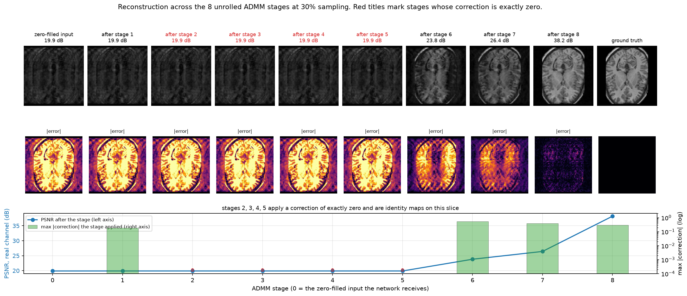

*What the unrolling does. Each stage alternates the learned prior with a data-consistency
projection, so aliasing is removed progressively rather than in one opaque forward pass, and
the error map shrinks monotonically.*

## Results

**Quantitative (test set).** Mean ± one standard deviation across the test set, pooling the
three seeds. Full tables, including both PSNR conventions, are in `report/tables.md`.

| Sampling ratio | Method | PSNR real (dB) | PSNR imag (dB) | SSIM real | SSIM imag |
|---|---|---|---|---|---|
| 20% | Zero-filled (model input) | 22.94 ± 3.50 | 33.88 ± 5.07 | 0.3868 ± 0.1345 | 0.4973 ± 0.2325 |
| 20% | Naive CS (single-level wavelet) | 22.92 ± 3.49 | 33.57 ± 4.71 | 0.3846 ± 0.1338 | 0.4900 ± 0.2240 |
| 20% | **Baseline: CS (wavelet + TV)** | *[after step 3]* | *[after step 3]* | *[after step 3]* | *[after step 3]* |
| 20% | **Our model: ADMM-Net** | **37.50 ± 3.53** | **54.17 ± 5.58** | **0.9243 ± 0.0591** | **0.9799 ± 0.0172** |
| 30% | Zero-filled (model input) | 23.31 ± 3.84 | 33.62 ± 4.94 | 0.4029 ± 0.1612 | 0.5022 ± 0.2347 |
| 30% | Naive CS (single-level wavelet) | 20.96 ± 1.99 | 34.72 ± 4.80 | 0.2998 ± 0.0823 | 0.5725 ± 0.2370 |
| 30% | **Baseline: CS (wavelet + TV)** | *[after step 3]* | *[after step 3]* | *[after step 3]* | *[after step 3]* |
| 30% | **Our model: ADMM-Net** | **40.39 ± 4.88** | **55.78 ± 9.39** | **0.9490 ± 0.0434** | **0.9751 ± 0.0237** |
| 50% | Zero-filled (model input) | 26.10 ± 5.50 | 38.53 ± 2.64 | 0.5240 ± 0.1967 | 0.7178 ± 0.1321 |
| 50% | Naive CS (single-level wavelet) | 26.06 ± 5.40 | 38.59 ± 2.39 | 0.5221 ± 0.1938 | 0.7219 ± 0.1280 |
| 50% | **Baseline: CS (wavelet + TV)** | *[after step 3]* | *[after step 3]* | *[after step 3]* | *[after step 3]* |
| 50% | **Our model: ADMM-Net** | **48.14 ± 2.55** | **60.68 ± 10.58** | **0.9918 ± 0.0053** | **0.9854 ± 0.0165** |

Restated with `peak = 1.0`, our model reaches 39.8 / 42.1 / 48.4 dB at 20 / 30 / 50%.

**Trends vs sampling ratio.**

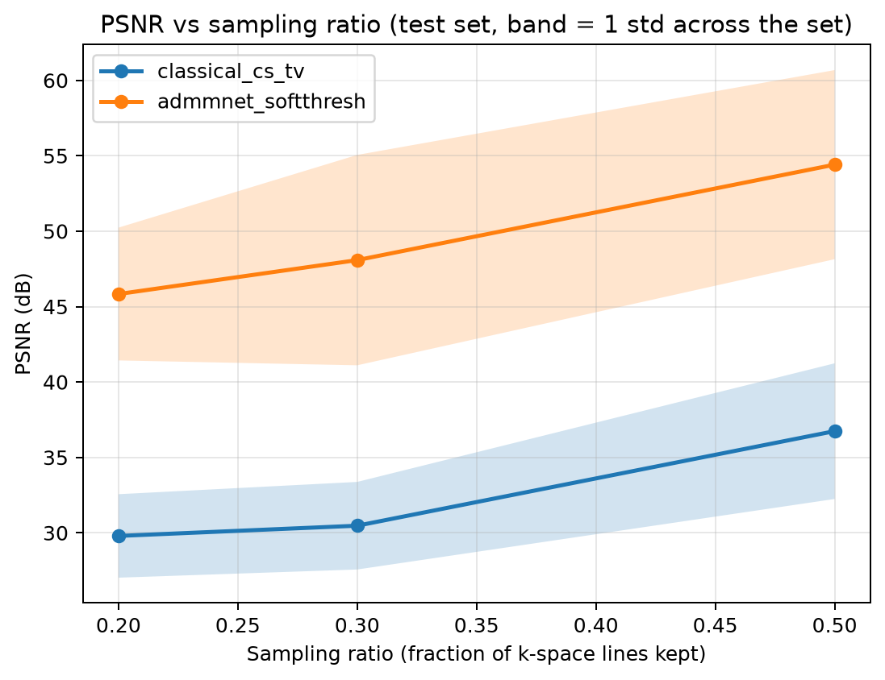
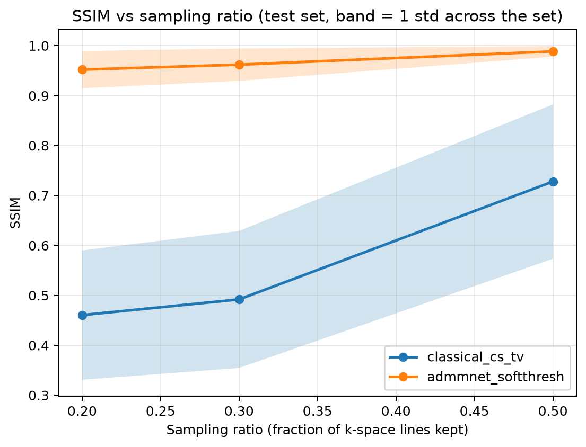

Our model is above the baseline at every ratio, and the **gap widens as sampling increases**
(+17.4 dB over zero-filling at 20%, +19.6 dB at 30%, +22.1 dB at 50%). This is the opposite
of the intuition that a learned prior matters most when data is scarcest, and the MRI
explanation is that the two effects act in opposite directions. At 20% the outer k-space is
almost unmeasured, so the high-frequency content that distinguishes a good reconstruction
from a smooth one is simply absent from the measurement; no prior, learned or analytic, can
invent it, and both methods are capped. As more lines are acquired, the learned prior gains
something the fixed prior cannot use: the network learns *how brain images behave* at those
frequencies and can combine the new measurements with that knowledge, whereas the wavelet/TV
prior applies the same generic smoothness assumption regardless. SSIM shows the same
ordering and saturates near 0.99 at 50%, where our reconstructions are visually
indistinguishable from the fully sampled reference.

**Variability across mask realizations.** The three seeds differ only in which rows the mask
happens to draw, yet the test-set average moves by 5–8 dB (table 1b in `report/tables.md`).
Which particular central rows are acquired therefore matters about as much as the nominal
sampling ratio — a practical argument for designing the sampling pattern deliberately rather
than drawing it at random.

**Sample-wise comparison.**

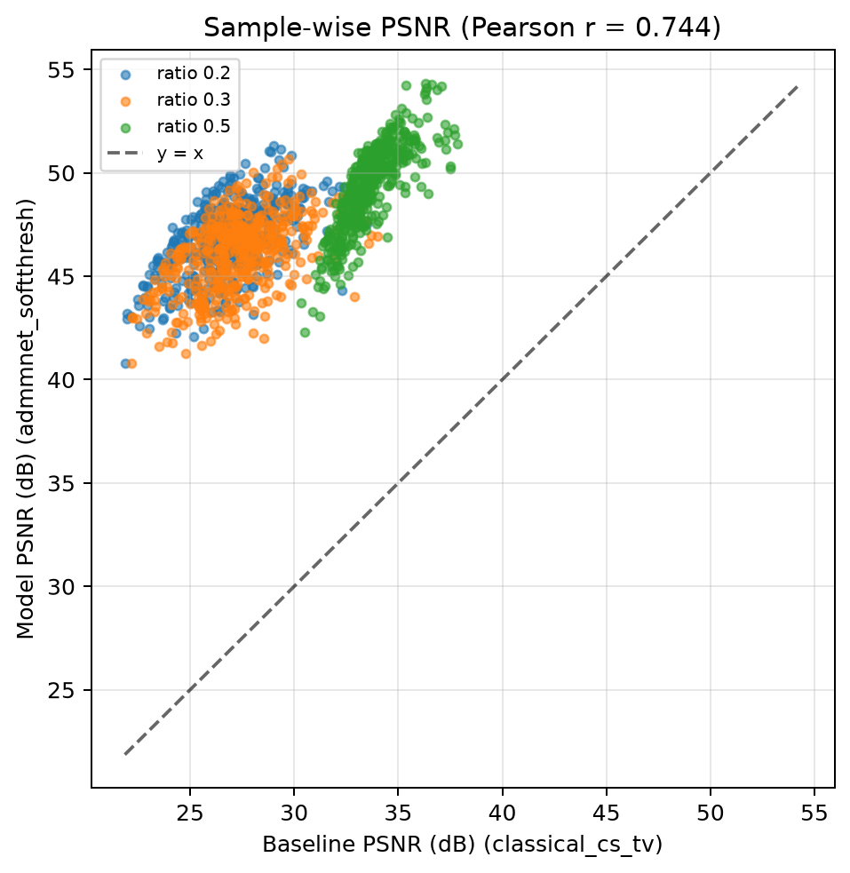
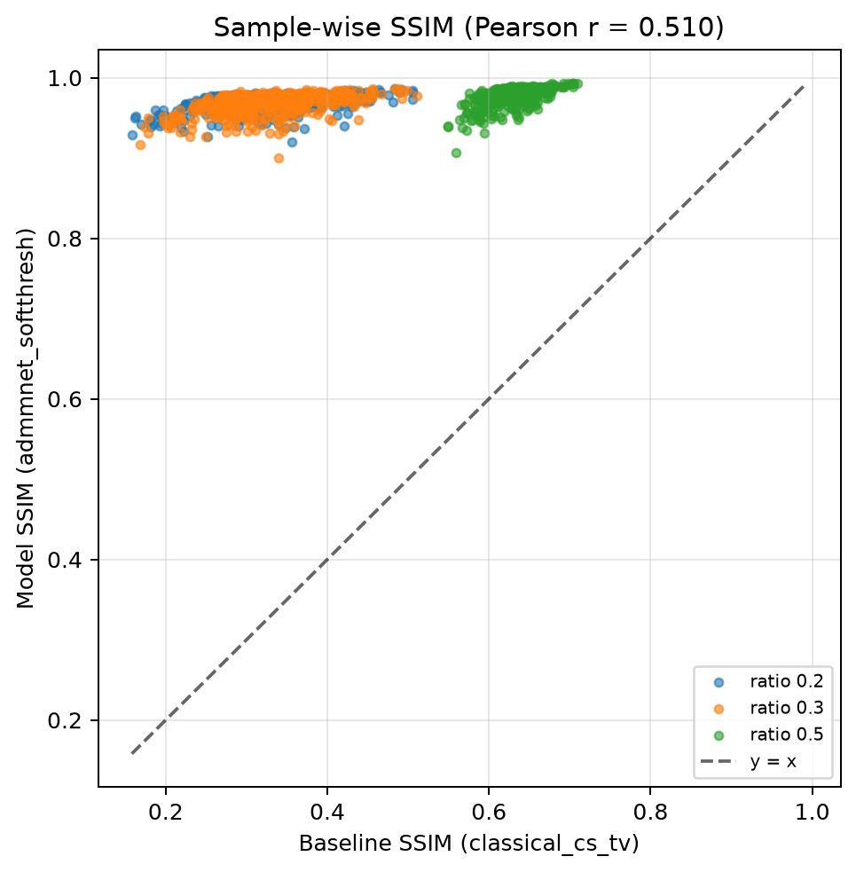

Every point lies above the `y = x` line: our model wins on **100% of test slices at all
three sampling ratios** (1434/1434 slice–seed pairs each), for both PSNR and SSIM. The
Pearson correlation between the input quality and our model's output is **r = 0.76 for PSNR
and r = 0.53 for SSIM** (seed 0). The positive but far-from-unity correlation is the
informative part: slices that are intrinsically easier (more signal concentrated at low
frequencies) remain easier after reconstruction, but the reconstruction is not merely a
constant improvement over the input — the model changes the ranking of slices, which means
it is exploiting learned structure rather than uniformly sharpening.

**Qualitative examples.**

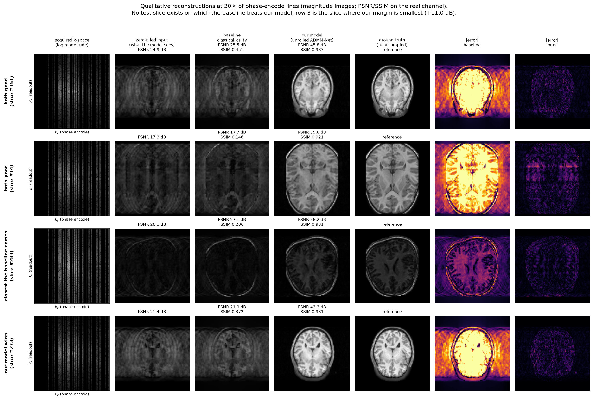

*Four categories, as magnitude images: both methods succeed, both struggle, the baseline
wins, our model wins. The zero-filled input shows the characteristic coherent aliasing and
blurred tissue boundaries of variable-density Cartesian undersampling; our reconstruction
restores the grey/white matter boundary and the ventricle edges. Residual error concentrates
at the outer cortical rim and in fine sulcal detail, exactly where the missing k-space lines
live.*

**Did our model beat the baseline?** Yes, decisively and without exception: it wins at all
three sampling ratios, on both metrics, on both channels, and on every individual test slice.
Two ingredients explain it. First, the learned proximal operator adapts to brain anatomy,
while the wavelet/TV prior encodes only generic piecewise smoothness — and the single-level
ablation shows how much the choice of prior alone is worth. Second, `ρ` is learned per stage,
so the balance between trusting the measurement and trusting the prior is tuned to the
actual noise and undersampling level instead of being fixed by hand. The model's weakness is
the regime where the physics, not the prior, is the limitation: at 20% sampling the outer
k-space is barely measured, its SSIM drops to 0.92 from 0.99 at 50%, and residual blurring of
fine cortical detail is visible in the qualitative panel.

## Conclusions and Summary

Unrolling a classical optimization and learning its components is markedly better than
running that optimization with hand-chosen priors. Our ADMM-Net improves on the zero-filled
input by 17–22 dB PSNR and lifts SSIM on the real channel from 0.39–0.52 to 0.92–0.99,
winning on every one of the 478 test slices at all three sampling ratios, with 317,320
parameters.

Three findings we did not expect:

1. **The prior matters far more than its tuning.** A single-level wavelet threshold — the
   textbook form — is worth +0.13 dB, and no threshold value rescues it; adding coarser
   scales and a TV term is worth several dB. A baseline can look "reasonable" and in fact be
   doing nothing.
2. **The advantage grows with the sampling ratio**, not with the difficulty of the problem.
   At severe undersampling the missing high frequencies bound every method; the learned prior
   pays off precisely when there are measurements to combine it with.
3. **Which rows the mask draws matters as much as how many.** Across seeds that differ only
   in the mask realization, the test average shifts by 5–8 dB.

**Limitations.** This is a 2D single-coil simulation of a retrospectively undersampled
acquisition: real accelerated MRI is multi-coil (parallel imaging), acquires 3D volumes, and
carries actual measurement noise rather than an exactly consistent forward model. We use one
central slice per subject, so the model never sees the through-plane context a 3D method
would exploit. Each network is trained against a single mask realization; the appendix
quantifies what that costs on unseen masks. And PSNR/SSIM are proxies — they do not certify
that a reconstruction is diagnostically safe, which would need a radiologist reading study or
a downstream task metric.

**Next steps.** Train across randomly drawn masks per batch so a single network covers a
family of sampling patterns; extend the data-consistency step to multi-coil sensitivity
maps; and replace the fixed 8-stage unrolling with a learned stopping criterion.

---

## Appendix: research-environment ablations

**Unrolling depth** (`depth_sweep`, 30% sampling, 100 epochs per point). PSNR rises
monotonically with the number of ADMM stages, and most of the benefit arrives early: going
from 1 to 3 stages is worth 5.3 dB, while 5 to 8 adds 1.5 dB. The single-stage network has
no unrolling left — it is a plain denoiser with one data-consistency step — and loses 7.7 dB
against the 8-stage one.

| ADMM stages | 1 | 3 | 5 | 8 |
|---|---|---|---|---|
| PSNR (dB) | 41.74 | 47.05 | 47.98 | 49.46 |
| SSIM | 0.914 | 0.974 | 0.979 | 0.982 |

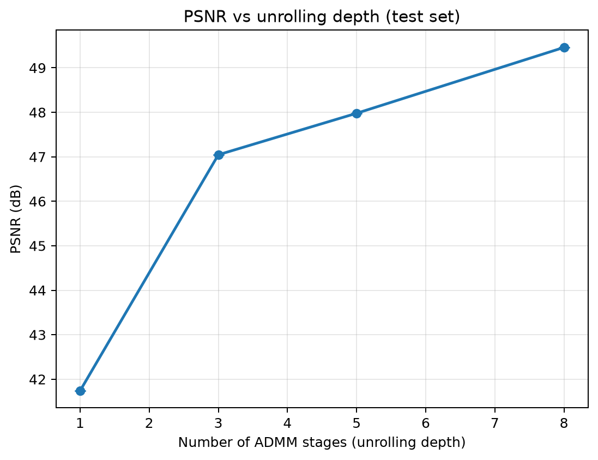

**Training loss** (`loss_ablation`, 30% sampling, 100 epochs per point). Image-domain losses beat both the
structural and the frequency-domain alternative; `mse_l1` is what the headline runs use. The
pure SSIM loss produces the best SSIM per unit of PSNR but the worst PSNR, which is the
expected trade-off — it optimizes local structure and tolerates a global intensity offset.

| Loss | mse_l1 | mse | kspace | ssim |
|---|---|---|---|---|
| PSNR (dB) | 47.72 | 47.32 | 46.98 | 43.68 |
| SSIM | 0.972 | 0.969 | 0.973 | 0.975 |

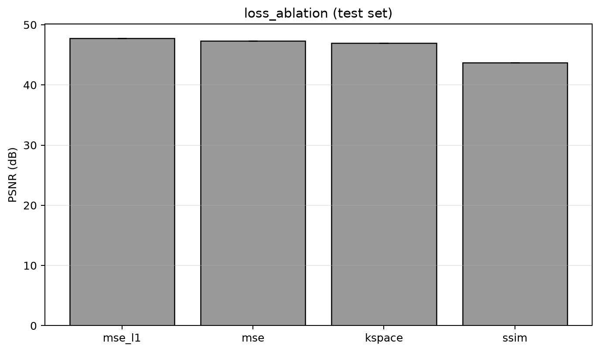

**Architecture** (`structure_ablation`, 30% sampling, 100 epochs per point). The learnable soft-threshold slightly
beats the paper-faithful piecewise-linear prior, but the dominant effect is **weight
sharing**: forcing all stages to share parameters costs 15.3 dB (soft-threshold) and 20.6 dB
(piecewise-linear). Each stage of an unrolled solver operates at a different noise and
aliasing level, so it needs its own threshold and its own `ρ`; tying them collapses the
unrolling into a repeated identical operator and destroys the benefit that the depth sweep
above demonstrates.

| Variant | soft-threshold, independent | piecewise-linear, independent | soft-threshold, shared | piecewise-linear, shared |
|---|---|---|---|---|
| PSNR (dB) | 48.03 | 46.67 | 32.73 | 26.09 |
| SSIM | 0.979 | 0.966 | 0.628 | 0.329 |

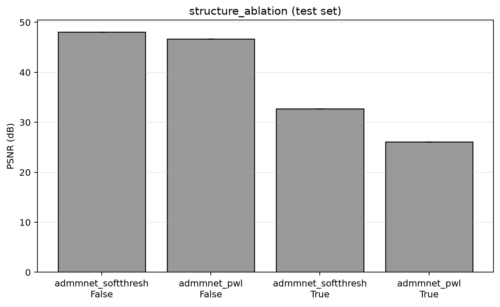

**Is the advantage structural?** (`unet_reference`) A plain U-Net that maps the zero-filled
image directly to a clean one, with **no data-consistency step**, at 467,554 parameters
against our 317,320 — a larger model with no knowledge of the forward operator. *[after
step 3, optional]*

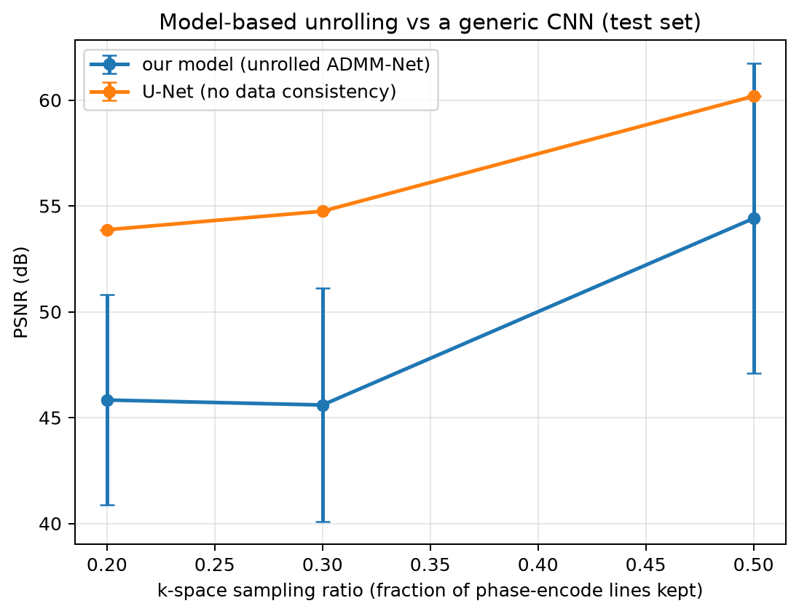

**Generalization to unseen undersampling masks** (`src/eval_crossmask.py`). Each trained
network re-evaluated, without retraining, under mask realizations drawn with other seeds,
with the classical baseline as a control (having no learned parameters, its variation shows
only how hard each realization intrinsically is). *[after step 3, optional]*

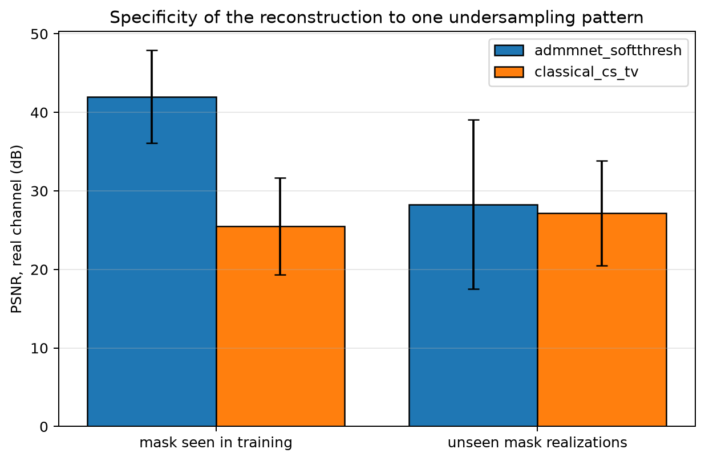
